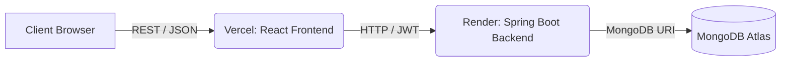

# Trillion Trader Platform


Trillion Trader is a comprehensive proprietary trading firm and forex broker aggregator platform. It provides traders with professional comparisons, trading tools, and educational resources, all managed through a secure backend admin dashboard.

## 📸 Screenshots

| Public Dashboard (Placeholder) | Admin Dashboard (Placeholder) |
| :---: | :---: |
|  |  |

## 🚀 Features

**Public Features:**
- **Prop Firms & Brokers Aggregator:** Detailed comparisons and reviews.
- **Trading Tools:** Profit/loss calculators and risk management utilities.
- **Educational Resources:** PDF guides, forex resources, and blogs.
- **Responsive Design:** Fully responsive UI for mobile, tablet, and desktop.
- **SEO Optimized:** Dynamic meta tags, Open Graph implementation, sitemaps, and Schema.org.

**Admin Features:**
- **Secure Authentication:** JWT-based stateless authentication with strict CORS policies.
- **Content Management (CMS):** Full CRUD capabilities for Blogs, Categories, Prop Firms, Brokers, Resources, Testimonials, and FAQs.
- **Rich Text Editing:** React Quill integrated for rich blog post creation.
- **User Management:** Manage admin access and roles.

## 🛠️ Tech Stack

**Frontend:** React 19 (TypeScript), Vite, TailwindCSS v4, Framer Motion, React Query, React Router DOM, React Helmet Async.
**Backend:** Java 21, Spring Boot 3.4, Spring Security, JWT (JSON Web Tokens).
**Database:** MongoDB (Spring Data MongoDB).
**Documentation:** OpenAPI / Swagger UI.

## 🏗️ Architecture



## 📂 Folder Structure

```text
trillion-trader/
├── frontend/               # React Vite Application
├── backend/                # Spring Boot Application
├── docs/                   # Additional documentation
├── screenshots/            # Project screenshots
├── DEPLOYMENT.md           # Step-by-step production deployment guide
├── render.yaml             # Render infrastructure-as-code configuration
├── LICENSE                 # MIT License
└── README.md               # This file
```

## ⚙️ Installation Guide (Local Development)

### 1. Prerequisites
- **Node.js:** v18 or higher
- **Java:** JDK 21
- **MongoDB:** A running local instance (`mongodb://localhost:27017`) or an Atlas URI.

### 2. Backend Setup
1. Navigate to the backend directory: `cd backend`
2. Configure your `.env` file based on `.env.example`.
3. Start the application: `./mvnw spring-boot:run`
   - The backend runs on `http://localhost:8080`.

### 3. Frontend Setup
1. Navigate to the frontend directory: `cd frontend`
2. Install dependencies: `npm install --legacy-peer-deps`
3. Configure your `.env` file based on `.env.example`.
4. Start the Vite development server: `npm run dev`
   - The frontend runs on `http://localhost:5173`.

### 4. Default Admin Login
On the first run, the backend seeds a default admin user:
- **Email:** `admin@trilliontraders.com`
- **Password:** `Admin123!`
> **Note:** Change this password immediately after logging in.

## 🔐 Environment Variables
See the `.env.example` files provided in the `frontend/` and `backend/` directories. **Never commit actual `.env` files containing real secrets.**

## 🌍 Deployment Guide
For full instructions on deploying to Vercel (Frontend), Render (Backend), and MongoDB Atlas, please see [DEPLOYMENT.md](DEPLOYMENT.md).

## 📄 API Documentation
When running the backend in development mode, the OpenAPI (Swagger) documentation is accessible at:
`http://localhost:8080/swagger-ui.html`

## 📜 License
This project is licensed under the MIT License - see the [LICENSE](LICENSE) file for details.
